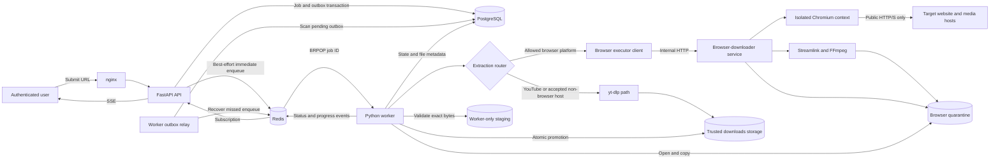
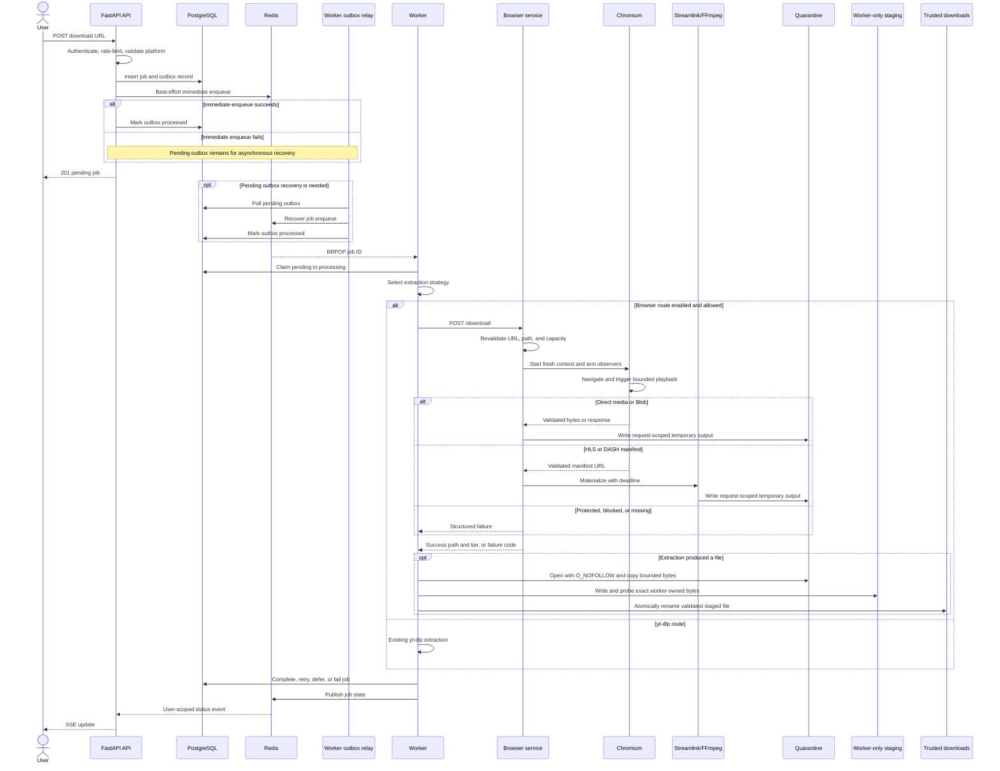
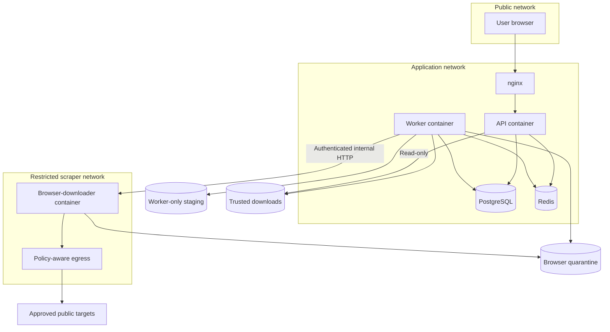

# Web-Based Media Scraper: Candidate Solution Architecture

| Attribute      | Value                                                                         |
| -------------- | ----------------------------------------------------------------------------- |
| Status         | Proposed candidate; partially implemented and feature-gated                   |
| Scope          | Non-YouTube, public, non-DRM video-on-demand media                            |
| Audience       | Application developers, platform engineers, security reviewers, and operators |
| Primary system | Vooglaadija API and worker platform                                           |
| Decision type  | One possible solution, not the only supported extraction strategy             |
| Last updated   | 2026-07-13                                                                    |

## Executive summary

This document proposes a web-based media scraper as a bounded fallback for URLs that are accepted by
Vooglaadija but are not extracted reliably by the existing yt-dlp path. In this architecture,
"web-based" means an internal HTTP service that runs an isolated headless browser. It does **not**
mean a public reverse proxy that mirrors a target website through a Vooglaadija domain.

The worker selects an extraction strategy for each job:

- YouTube and other API-accepted platforms not assigned to the browser route continue through
  yt-dlp. Unknown domains are rejected by the API before worker routing.
- Today, API-submitted TikTok and Instagram URLs can reach the browser route when the feature flag
  is enabled. The worker also recognizes Twitter/X, but the API does not yet accept those domains.
- The scraper opens the public page in a fresh Chromium context, observes network traffic through
  the Chrome DevTools Protocol (CDP), and falls back to narrowly scoped DOM media detection.
- Direct media responses are written to shared storage. HLS or DASH manifests are handed to an
  established media backend such as Streamlink and FFmpeg.
- The worker retains ownership of job state, retries, circuit breaking, status publication, file
  lifecycle, and delivery to the user.

The solution deliberately excludes DRM circumvention, CAPTCHA bypass, logged-in user sessions,
paywalls, generic website proxying, and a claim of universal compatibility. Those boundaries are
necessary for security, predictable operations, and honest product behavior.

Parts of this design already exist in `packages/browser-downloader/` and
`worker/browser_executor.py`. Production adoption still requires hardened deployment isolation,
egress enforcement, service authentication, end-to-end tests, observability, and a controlled
platform rollout.

## 1. Context and problem

Vooglaadija accepts URLs from more platforms than the original YouTube-focused extraction path can
serve reliably. Some sites construct media after page load, expose only short-lived manifest URLs,
or use browser APIs that a static HTTP client does not execute. Accepting those URLs and failing
much later with a generic error creates an inconsistent product contract.

The architecture must therefore make one of three outcomes explicit for every submitted platform:

1. A stable extraction path is supported.
1. A browser-based path is experimental and feature-gated.
1. The platform is rejected early with a clear unsupported response.

This proposal supplies the second path without replacing the existing yt-dlp implementation.

### 1.1 Why a real browser can help

A real browser executes the same page JavaScript that creates media elements and initiates network
requests. Observing that execution can reveal:

- direct `video/*` responses;
- progressive MP4 or WebM resources;
- HLS `.m3u8` playlists;
- DASH `.mpd` manifests; and
- Blob objects created from public, non-DRM media bytes.

This increases coverage for dynamic pages, but it does not make extraction universal. Signed URLs
may expire, anti-automation challenges may block navigation, content may require authentication, and
encrypted media may be unusable by design.

### 1.2 Architecture decision

Use a standalone Node.js browser-downloader service, called only by the existing Python worker, with
the following extraction order:

1. CDP network observation.
1. DOM Blob detection when network observation finds no usable media.
1. Streamlink or FFmpeg materialization for supported manifests.
1. A structured terminal failure when media is protected, blocked, absent, or unsafe.

Do not implement the original transcript's wildcard reverse proxy, Base32 host routing, residential
proxy mesh, browser-side HLS concatenation, or WebSocket subsystem. Those mechanisms add substantial
risk and duplicate capabilities already owned by the Vooglaadija worker, Redis Pub/Sub, and SSE
pipeline.

## 2. Goals, non-goals, and success criteria

### 2.1 Goals

- Improve extraction coverage for an explicit set of public, non-DRM VOD platforms.
- Preserve the existing API, queue, job model, retry pipeline, SSE updates, and file-delivery flow.
- Isolate browser execution from the API and worker processes.
- Return stable, machine-readable errors that support correct retry and user messaging.
- Bound CPU, memory, network, disk, subprocess, and execution time per request.
- Prevent arbitrary URL fetching from becoming an SSRF or open-proxy capability.
- Allow immediate rollback through a disabled-by-default feature flag.
- Make compatibility measurable per platform and extraction tier.

### 2.2 Non-goals

- Downloading media from every website.
- Circumventing Widevine, FairPlay, PlayReady, EME, paywalls, access controls, or geo-restrictions.
- Solving CAPTCHAs or deliberately bypassing platform security controls.
- Importing a user's browser cookies, authorization headers, or logged-in session.
- Mirroring or rewriting a target website under a Vooglaadija-controlled domain.
- Supporting WebRTC, peer-to-peer media, or arbitrary WebSocket media protocols.
- Capturing live streams in the first production release.
- Recording playback at accelerated speed. Media clocks, audio, and network delivery do not support
  the proposed 100x approach.
- Building custom HLS or DASH parsers when maintained media tools already provide the capability.
- Guaranteeing permanent support for sites whose page behavior changes without notice.

### 2.3 Success criteria

The solution is ready for a platform only when all of the following are true:

- The platform has a named product status: supported, experimental, or blocked.
- At least one reproducible public fixture succeeds in a production-like environment.
- DRM, private content, anti-bot challenges, timeouts, and missing media produce distinct outcomes.
- No request can reach private, loopback, link-local, metadata, or unauthorized network ranges.
- The browser and all child processes terminate after success, cancellation, timeout, or crash.
- Output is validated, stored inside the configured storage root, and served through the existing
  authenticated file endpoint.
- Operators can observe success rate, duration, tier usage, saturation, and failure class without
  logging signed media URLs or credentials.
- Disabling `BROWSER_DOWNLOADER_ENABLED` restores the previous yt-dlp-only behavior.

## 3. Current implementation baseline

The repository contains a useful partial implementation. This document treats it as the baseline,
not as proof of production readiness.

| Capability               | Current state                                              | Architecture disposition                                        |
| ------------------------ | ---------------------------------------------------------- | --------------------------------------------------------------- |
| Browser microservice     | Node.js, Express, Playwright/Chromium on port 3000         | Retain                                                          |
| Worker integration       | HTTP client and hostname-based routing                     | Retain and harden                                               |
| Feature flag             | Disabled by default                                        | Retain as global kill switch                                    |
| Tier 1                   | CDP response and manifest detection                        | Retain                                                          |
| Tier 2                   | DOM Blob and media-element detection                       | Retain with live-site validation                                |
| Manifest handling        | Streamlink, then limited HLS/FFmpeg fallback               | Retain within defined format scope                              |
| DRM and anti-bot signals | Structured terminal errors                                 | Retain; improve precision                                       |
| URL validation           | Initial scheme and DNS checks; limited redirect checks     | Treat as partial; require enforced egress policy                |
| Page traffic limits      | No total request, redirect, host, or egress-byte budget    | Add browser-level admission limits                              |
| Source URL privacy       | Full URL persisted, displayed, logged, and used for replay | Split redacted display from encrypted execution lifecycle       |
| Output validation        | Root path and extension allowlist                          | Add worker-owned quarantine validation and atomic promotion     |
| Storage path contract    | Worker passes storage root; API serves only `downloads/`   | Inconsistent; fix before enablement                             |
| Concurrency              | In-process limit of two                                    | Make configurable and capacity-driven                           |
| Cancellation             | Overall timeout does not abort underlying browser work     | Noncompliant; propagate cancellation before enablement          |
| Service deployment       | Dockerfile exists                                          | Add root deployment, isolation, and policy                      |
| Progress                 | Single synchronous HTTP response                           | Keep job status only initially; add progress later if justified |
| Metrics                  | Not integrated for browser extraction                      | Required before broad rollout                                   |
| Real-site smoke tests    | Deferred                                                   | Required per enabled platform                                   |

## 4. System context



### 4.1 Trust boundaries

The architecture has four important trust boundaries:

1. **User to API:** The submitted URL is untrusted input and must pass the existing product-level
   platform validation.
1. **Worker to scraper:** This is a privileged internal call because it can start a browser and
   write output. It must not be exposed directly to users or the public internet.
1. **Scraper to target:** All target content, redirects, scripts, media, filenames, and headers are
   hostile until validated.
1. **Scraper to storage:** Only validated media output may cross from the browser sandbox into the
   storage area served by the API.

## 5. Component architecture

### 5.1 API server

The API remains the authenticated product boundary. It owns:

- URL submission and request validation;
- user authorization and rate limiting;
- creation of `DownloadJob` and outbox records;
- job-list and file-download endpoints; and
- SSE delivery of worker-published state.

The API must not call the browser service directly. Browser work is long-running, expensive, and
untrusted; it belongs behind the Redis queue and worker lifecycle.

### 5.2 Worker and extraction router

The worker remains the workflow owner. `worker/job_executor.py` chooses an executor after claiming a
job:

- browser routing is considered only when `BROWSER_DOWNLOADER_ENABLED=true`;
- the current worker routing set covers TikTok, Instagram, and Twitter/X host suffixes;
- YouTube and API-accepted hosts outside the browser set use the existing yt-dlp path; and
- browser extraction skips the YouTube-specific throttle predictor.

Routing is a product policy, not a claim that the service can safely browse arbitrary hosts. New
platforms require an explicit allowlist change, tests, observability labels, and review.

The API's current supported-URL allowlist does not include Twitter/X or arbitrary unknown domains.
No Twitter/X request can reach the browser path through the normal API until the API and worker
policies are intentionally reconciled. Unknown domains are rejected before queueing, even though a
legacy or internally created unknown-host job would fall through to yt-dlp in the worker. The
product must not claim support while the layers disagree.

### 5.3 Browser executor client

`worker/browser_executor.py` adapts the browser service to the worker's existing
`(file_path, file_name, title)` result contract. It owns:

- construction of the internal `POST /download` request;
- HTTP timeout handling;
- circuit breaker execution;
- response-shape validation;
- mapping service errors to the worker's `ErrorCategory`; and
- structured logs for service failures.

It does not own browser behavior, file processing, or platform-specific page interaction.

### 5.4 Browser-downloader service

The browser service is a replaceable extraction adapter. Its responsibilities are intentionally
narrow:

- validate the URL and output location again at the trust boundary;
- enforce concurrency and deadlines;
- create a fresh browser and context for one request;
- discover public media through the configured tiers;
- materialize a supported media file;
- publish the file atomically inside the output root;
- return one structured success or failure response; and
- close the context, browser, timers, streams, and child processes on every path.

The service should be stateless between requests. PostgreSQL job state and Redis event state remain
outside it.

### 5.5 Browser context

Each request receives a new incognito browser context with no imported cookies, local storage,
authorization headers, or service-worker state. The context must not be reused across users.

Permitted page interaction is minimal:

- navigate to the submitted public URL;
- wait for a bounded page-load condition;
- locate a native video element or a small, reviewed set of play controls;
- click only the play control associated with the media element; and
- observe media-related events.

The scraper must not dismiss arbitrary dialogs, submit forms, accept consent on behalf of a user,
follow advertisements, or interact with login and payment flows.

### 5.6 Media discovery tiers

#### Tier 1: CDP network observation

Tier 1 is the primary path because it observes the resources the page actually requests without
rewriting the page.

The service arms CDP and DRM detection before navigation, then watches for:

- `Content-Type: video/*`;
- URLs with approved progressive media extensions;
- HLS manifests ending in `.m3u8`; and
- DASH manifests ending in `.mpd`.

Candidate selection must use both response metadata and URL structure. Advertisements, tracking
pixels, tiny previews, and unrelated video resources may appear before the main media. A production
scorer should prefer candidates using content length, video dimensions when known, media-element
association, and manifest type rather than accepting the first syntactic match.

Tier 1 outcomes are:

- a direct response that can be streamed to a temporary file;
- a validated manifest URL passed to the media backend;
- a terminal DRM or anti-bot error; or
- no candidate before the tier deadline, which falls through to Tier 2.

A Tier 1 discovery timeout is not a job timeout. It is a controlled fallthrough signal.

#### Tier 2: DOM and Blob detection

Tier 2 addresses pages that create media inside the browser runtime. It may observe:

- `URL.createObjectURL` calls involving real `Blob` objects;
- a media element whose source changes after playback starts; and
- bounded Media Source Extension metadata needed to associate page playback with observed requests.

The hook buffers must be capped. Non-Blob values such as `MediaSource` must not be treated as
downloadable bytes. If a Blob is captured, its size and MIME type must be checked before it leaves
the browser context.

Tier 2 ends with one of four results: media found, DRM detected, anti-bot challenge detected, or
`no_media_found`. It must not hide a protected or blocked page behind the generic no-media result.

#### Tier 3: recording fallback

A screencast or screen-recording fallback is not part of the proposed production architecture. It is
lossy, runs in real time, complicates audio capture and synchronization, consumes substantial CPU,
and risks recording page chrome or unrelated content. If ever explored, it requires a separate
decision, explicit operator flag, legal review, user-visible quality warning, and its own isolated
capacity pool.

### 5.7 Media materialization

Media discovery and media materialization are separate concerns.

| Discovered resource                   | Materialization path                            | Result                                              |
| ------------------------------------- | ----------------------------------------------- | --------------------------------------------------- |
| Direct MP4/WebM response              | CDP response stream to bounded quarantine file  | Preserve compatible container                       |
| VOD HLS manifest                      | Streamlink preferred; limited reviewed fallback | Remux to approved output container                  |
| Static VOD DASH manifest              | Streamlink/FFmpeg when supported                | Mux audio and video to approved container           |
| Real Blob bytes                       | Bounded write to temporary file                 | Preserve validated media type                       |
| DRM/EME content                       | Stop                                            | `drm_detected`                                      |
| Live/event HLS or dynamic DASH        | Stop                                            | `live_not_supported`                                |
| Encrypted HLS or unsupported manifest | Stop                                            | Stable failure; never publish ciphertext as success |

The current code can materialize large response bodies in memory. The target implementation should
stream direct media to disk and use byte limits during transfer. This reduces multiple in-memory
copies across Chromium, CDP, Node.js, and the file writer.

The preferred direct-media mechanism is Chromium's CDP `Fetch.takeResponseBodyAsStream` after the
response has been selected. It preserves the response already obtained by the isolated browser and
avoids a second request with different cookies, headers, source IP, or token timing. A controlled
re-fetch is permitted only in a reviewed platform profile, through the same egress checks, using
only ephemeral anonymous context headers and never user credentials.

Before Streamlink sees a manifest, a bounded preflight must enforce the VOD-only boundary. An HLS
media playlist must terminate with `#EXT-X-ENDLIST`; event/live playlists and playlists that exceed
the configured segment or duration limit are rejected. DASH must be static rather than
`type="dynamic"`. Ambiguous manifests fail closed. The initial production scope also rejects
`#EXT-X-KEY` and `#EXT-X-SESSION-KEY`, including publicly retrievable AES-128 keys. AES-128 is not
necessarily DRM, but supporting key retrieval expands the SSRF and secret-handling surface and
requires a separate decision.

Streamlink and FFmpeg must be invoked with argument arrays, never a shell command string. Their
stdout and stderr pipes must be drained, their process groups must receive cancellation, and a hard
deadline must escalate from graceful termination to forced termination.

### 5.8 Shared storage

The current path contract is not safe or internally consistent: the worker sends
`settings.storage_path` to the browser service, while the API serves files only from
`<STORAGE_PATH>/downloads`. The browser service can therefore return a file outside the directory
accepted by the API. This is a pre-enable blocker.

The target architecture uses a trusted publication boundary with one canonical container root,
`/app/storage`:

- `/app/storage/quarantine/browser/<attempt_id>/` is writable by the browser service and worker but
  is never served by the API;
- `/app/storage/staging/browser/<attempt_id>/` is writable only by the worker and is never mounted
  into the browser service or API;
- `/app/storage/downloads/` is writable only by the worker, read-only to the API, and not mounted
  into the browser service; and
- the browser service returns an attempt-scoped quarantine path or relative output key, never a path
  already considered downloadable.

Keeping worker staging and downloads on the same filesystem permits atomic promotion. Quarantine is
never promoted directly because a long-lived scraper retains write access and could mutate a file
between validation and rename. If a deployment uses object storage, immutable object versions and a
worker-controlled destination key must provide the equivalent byte-identity guarantee.

The publication sequence is:

1. The worker creates a job-attempt quarantine directory and passes only that location or key.
1. The scraper writes one UUID-named file with restrictive permissions and a byte limit.
1. The scraper returns the quarantine result without updating job state.
1. The worker independently resolves the returned path and opens it with `O_NOFOLLOW`, requiring a
   regular file inside the exact attempt directory.
1. Through that file descriptor, the worker copies the bounded bytes into its own staging directory
   and records a content hash. The scraper cannot access the staged copy.
1. The worker closes the source and probes the exact staged bytes with FFprobe or an equivalent
   parser, enforcing size, ownership, approved container, and expected media-stream rules.
1. The worker flushes and atomically renames that staged file into
   `/app/storage/downloads/<uuid>.<ext>`.
1. Only then does the worker mark the job completed and persist the trusted final path.

Failed and cancelled requests must remove attempt-scoped files. Existing cleanup covers known
partial paths and expired completed downloads; a general quarantine/orphan reconciliation task is a
target requirement, not an existing capability.

## 6. End-to-end execution flow



### 6.1 Job state ownership

The browser service never updates `DownloadJob` directly. The worker is the only component that
transitions the job through the valid states:

```text
pending -> processing -> completed
                      -> failed
                      -> deferred -> processing
                      -> pending/retry -> processing
```

This preserves the existing retry scheduler, DLQ, zombie sweeper, outbox recovery, and SSE behavior.

### 6.2 Cancellation and timeout propagation

Deadlines must be nested so an outer layer allows the inner layer enough time to clean up:

```text
worker attempt deadline
  > internal HTTP request deadline
    > browser service overall deadline
      > media subprocess or transfer deadline
        > individual navigation and discovery tier deadlines
```

This hierarchy is a target invariant, not current behavior. The worker-side browser HTTP timeout and
the service request timeout both default to 300 seconds, and the outer worker attempt may use the
same budget. In addition, the service's current `Promise.race` returns and releases its semaphore
without aborting the losing browser operation. A production fix must create one request-scoped abort
signal, propagate client disconnect and deadline cancellation through every tier and subprocess, and
validate positive cleanup margins between nested timeouts at startup.

When any outer deadline expires, cancellation must propagate to Chromium, active fetches,
Streamlink, FFmpeg, timers, and temporary files. Releasing a concurrency slot while background work
continues is not acceptable because it defeats capacity limits.

## 7. Service interfaces

### 7.1 Health endpoint

```http
GET /health
```

Current success response:

```json
{
  "status": "ok"
}
```

`/health` is liveness only. Production deployment should also provide readiness that verifies the
output root, Chromium launch capability, and required media binaries without navigating to an
external website.

### 7.2 Download endpoint

```http
POST /download
Content-Type: application/json
```

Current request:

```json
{
  "url": "https://www.example-platform.test/public/video/123",
  "output_dir": "/output"
}
```

Current success response:

```json
{
  "status": "success",
  "file_path": "/output/550e8400-e29b-41d4-a716-446655440000.mp4",
  "tier_used": 1
}
```

Current failure response:

```json
{
  "status": "failed",
  "error": "no_media_found",
  "tier_used": null
}
```

### 7.3 Current HTTP semantics

| Status | Meaning                                           | Worker treatment                   |
| ------ | ------------------------------------------------- | ---------------------------------- |
| `200`  | Successful extraction and valid final file        | Complete job                       |
| `400`  | Invalid JSON, URL, output path, or request shape  | Blocked configuration/client error |
| `502`  | Extraction failed after the request was accepted  | Classify structured error          |
| `503`  | Browser capacity exhausted or service unavailable | Transient retry/backoff            |

The endpoint must be reachable only on the private service network. Production must add workload
authentication, such as mutual TLS or a short-lived service credential, plus network policy that
allows calls only from workers.

### 7.4 Contract evolution

The current `output_dir` parameter exposes more filesystem authority than the caller needs. A future
version should accept an attempt ID or output key and let the service resolve its quarantine root
locally. Until then, `output_dir` must identify an exact worker-created attempt directory under the
quarantine root; the worker must distrust and revalidate the returned path before promotion.

Useful future response fields include `media_type`, `bytes_written`, `duration_seconds`, and a
sanitized platform identifier. Contract changes must be versioned or remain backward-compatible with
the worker adapter.

## 8. Error model and retry policy

The service returns a stable signal; the worker owns retry policy. Current behavior and the target
contract differ and must not be conflated.

### 8.1 Current contract

| Signal or condition                     | Current worker category        | Current behavior                                |
| --------------------------------------- | ------------------------------ | ----------------------------------------------- |
| `drm_detected`                          | `BLOCKED`                      | Terminal                                        |
| `anti_bot_block`                        | `BLOCKED`                      | Terminal                                        |
| `no_media_found`                        | `NOT_FOUND`                    | Terminal                                        |
| service-emitted `timeout`               | `TIMEOUT`                      | Bounded retry                                   |
| overall service `request_timeout`       | `TRANSIENT` as `network_error` | Bounded retry; underlying work is not cancelled |
| `network_error`                         | `TRANSIENT`                    | Bounded retry                                   |
| invalid request / service `4xx`         | `BLOCKED`                      | Terminal until corrected                        |
| `concurrency_limit` / service `503`     | `TRANSIENT`                    | Bounded retry                                   |
| other service `5xx` or invalid response | `TRANSIENT`                    | Bounded retry                                   |
| circuit open                            | `TRANSIENT`                    | Bounded retry; not deferred                     |

The worker adapter recognizes `private_content` and `http_429`, but the Node service does not emit
them. `circuit_open` is synthesized by the worker client. Today, every exception raised inside the
browser circuit breaker can count as a service failure, including valid content outcomes such as
DRM, anti-bot, no-media, and invalid-request responses. That can open the shared breaker even while
the service is healthy.

### 8.2 Target contract

| Service signal or condition                        | Worker category                                 | Retry behavior               | Counts against service breaker |
| -------------------------------------------------- | ----------------------------------------------- | ---------------------------- | ------------------------------ |
| `drm_detected`                                     | `BLOCKED`                                       | No retry                     | No                             |
| `anti_bot_block`                                   | `BLOCKED`                                       | No immediate retry           | No                             |
| `no_media_found` / `private_content`               | `NOT_FOUND`                                     | No retry                     | No                             |
| `live_not_supported`                               | `FORMAT_UNAVAILABLE`                            | No retry                     | No                             |
| `encrypted_hls_unsupported`                        | `FORMAT_UNAVAILABLE`                            | No retry                     | No                             |
| `timeout` / `request_timeout`                      | `TIMEOUT`                                       | Bounded retry                | Yes                            |
| transport `network_error`                          | `TRANSIENT`                                     | Bounded retry with jitter    | Yes                            |
| upstream `http_429`                                | `RATE_LIMITED`                                  | Backoff                      | No                             |
| service `5xx`, invalid protocol response, or crash | `TRANSIENT`                                     | Bounded retry                | Yes                            |
| invalid request / other service `4xx`              | `BLOCKED`                                       | No retry until corrected     | No                             |
| local capacity rejection                           | `TRANSIENT`                                     | Backoff or alternate replica | No                             |
| circuit open                                       | Deferred or transient by explicit worker policy | Wait for recovery            | Not applicable                 |

The target breaker must use an explicit failure predicate. Only transport failures, timeouts,
service `5xx`, invalid service protocol responses, and crashes indicate browser-service health.
Target content and policy outcomes are recorded in platform metrics but do not affect the service
breaker. The new live and encryption signals require a versioned or backward-compatible contract
extension.

Errors exposed to users should be stable and platform-aware without revealing internal paths, signed
URLs, target response bodies, subprocess output, or anti-automation implementation details.

## 9. Security architecture

### 9.1 Security principles

- Treat the browser as a hostile-code execution environment.
- Treat URL validation in application code as necessary but insufficient.
- Grant the scraper no database, Redis, JWT, or API credentials.
- Do not forward user cookies, browser sessions, authorization headers, or client IP headers.
- Do not remove or rewrite target CSP, CORS, frame, or cookie protections.
- Make the scraper an outbound client, never a public content proxy.
- Fail closed when a redirect, protocol, response, file, or network destination is ambiguous.

### 9.2 Threats and controls

| Threat                                                  | Required controls                                                                                                                                                                                              |
| ------------------------------------------------------- | -------------------------------------------------------------------------------------------------------------------------------------------------------------------------------------------------------------- |
| SSRF to private services or cloud metadata              | HTTP/S-only URLs; public-IP validation for every DNS answer and redirect; block loopback, private, link-local, multicast, unspecified, and metadata ranges; network egress proxy/firewall as final enforcement |
| DNS rebinding between validation and browser connection | Resolve and enforce destinations at the egress layer; do not rely only on an earlier application DNS lookup                                                                                                    |
| Open-proxy abuse                                        | Internal-only endpoint; service authentication; platform allowlist; per-user API rate limit; worker-only network policy                                                                                        |
| Browser exploit or malicious JavaScript                 | Patched, pinned Chromium; non-root UID; no host namespaces; read-only root; dropped capabilities; seccomp and preferably gVisor or equivalent sandbox; ephemeral context and temp area                         |
| Cross-user state leakage                                | New context per request; no persistent profile; no shared cookie jar; close and destroy context after each request                                                                                             |
| Path traversal or symlink escape                        | Realpath validation with directory-boundary check; fixed storage root; service-generated UUID names; no target-derived path components                                                                         |
| Quarantine mutation during validation                   | Open with `O_NOFOLLOW`; copy bounded bytes into worker-only staging; validate and promote only the exact staged copy                                                                                           |
| Command injection                                       | `spawn` with fixed executable and argument array; no shell; no target-derived output switches                                                                                                                  |
| Resource exhaustion                                     | Request/body/file limits; concurrency semaphore; CPU/memory/PID quotas; navigation, transfer, and subprocess deadlines; bounded logs and hook arrays                                                           |
| Malicious or mislabeled output                          | Extension allowlist plus content probing; size limit; atomic publication; serve as attachment with `nosniff`; optional malware scan before availability                                                        |
| Signed URL or token leakage                             | Redact query strings and headers from logs/traces; never use full URLs as metric labels; short log retention                                                                                                   |
| Unauthorized private content                            | Public unauthenticated contexts only; no cookie import; stop on login wall or access challenge                                                                                                                 |
| Dependency compromise                                   | Lockfiles, image digests, SBOM, vulnerability scanning, controlled Chromium/Streamlink/FFmpeg update cadence                                                                                                   |

### 9.3 Network policy

The service needs public DNS and outbound HTTPS, but it must not have unrestricted access to the
Vooglaadija network. A production deployment should enforce:

- inbound access only from worker instances;
- no access from the scraper to PostgreSQL, Redis, API admin endpoints, Docker socket, or cloud
  metadata;
- outbound DNS only through an approved resolver;
- outbound HTTP/S through a policy-aware egress layer that blocks forbidden address ranges after
  resolution and on redirects; and
- no inbound route from the public reverse proxy to port 3000.

Current validation is only partial: it checks the initial hostname, and the manual manifest fallback
validates its own redirects and derived URLs, but Chromium navigation redirects and redirects
handled inside Streamlink are not pinned to the validated destination set. A policy-aware egress
layer that enforces the rule at connection time is therefore a hard pre-enable gate, not defense in
depth that may be deferred.

Domain-only filtering is insufficient because media commonly comes from separate CDN hosts. The
policy should validate public destinations while collecting observed media hosts for review.

### 9.4 Content and legal policy

Architecture controls do not determine whether downloading a particular work is authorized. Product
policy must define allowed use, retention, takedown handling, jurisdiction, and platform terms. The
system should require users to download only content they are entitled to access and should support
a domain denylist independent of technical capability.

### 9.5 Source URL and transient media data

The current application persists the complete submitted URL in `DownloadJob.url` and
`FailedJob.url`, returns it in job views, and uses the failed-job copy as the source for DLQ replay.
Query parameters can contain signed tokens, referral identifiers, or other sensitive data. Redacting
that single field after failure would break replay, so the target model separates purpose and
access:

- `display_url` stores a canonical URL with userinfo, fragments, sensitive query values, and known
  tracking parameters removed; API and web responses expose only this value;
- an encrypted `execution_url` field or separately protected secret record retains the exact URL
  needed by the worker, never by ordinary read routes;
- the execution URL TTL covers the active job, automatic retries, and the explicitly configured DLQ
  replay window, after which it is destroyed and the job becomes non-replayable without user
  resubmission;
- encryption keys are managed outside PostgreSQL and access is limited to the job-creation and
  worker execution paths;
- job deletion removes the display value, encrypted execution value, and media; and
- derived manifest, segment, Blob, and signed CDN URLs remain in request memory only—never
  PostgreSQL, Redis, Pub/Sub, SSE, metrics, or ordinary logs.

Until the data model and replay path are migrated together, do not overwrite the current `url` field
as a standalone redaction change. A one-way URL hash may be retained for short-lived operational
correlation after the execution value expires.

## 10. Reliability and resource management

### 10.1 Backpressure

Each request launches Chromium and may launch media subprocesses. The service must reject excess
work instead of building an unbounded in-memory queue. The current limit is two concurrent requests
per service instance; production capacity must be measured and configurable.

The worker interprets saturation as transient and applies existing retry/backoff behavior. A short
retry hint may be added later, but the browser service must not create a second durable queue.

### 10.2 Circuit breaker

The browser executor uses a dedicated circuit breaker so repeated service failures do not stall all
worker capacity. The current policy opens after five failures, probes half-open after 30 seconds,
and closes after three successful probes. Redis-distributed state is optional and should be enabled
when multiple workers share the same browser service pool.

The current breaker records content-level exceptions as failures; this must be corrected before
enablement. The target failure predicate is defined in Section 8.2. A single health breaker is
adequate initially once it measures only service health. Per-platform availability controls become
useful when metrics show one platform being blocked while the service remains healthy.

### 10.3 Idempotency and retries

The endpoint is operationally at-least-once because the worker may retry after losing a response.
UUID filenames prevent overwrite, but retries can leave orphan files. The target design should pass
a job attempt identifier, track request-scoped temporary output, and remove unreferenced files
during normal cleanup.

A completed `DownloadJob` must never be overwritten by a late response from an earlier attempt.

### 10.4 Resource limits

Each replica requires explicit limits for:

- concurrent Chromium processes;
- CPU and memory;
- process count and open files;
- `/tmp` and output bytes;
- maximum response and final file size;
- maximum media duration, manifest depth, and segment count;
- navigation redirect depth, page request count, unique-host fan-out, and aggregate egress bytes;
- permitted request methods and reviewed exceptions for a platform profile;
- navigation, tier, download, and overall request duration; and
- Streamlink/FFmpeg child-process lifetime.

Browser request interception should block WebRTC, unexpected WebSockets, downloads initiated by page
scripts, non-HTTP/S schemes, and methods other than `GET`/`HEAD` unless a reviewed platform profile
requires a narrowly scoped anonymous `POST`. Reaching an allowed landing page must not grant that
page unbounded authority to generate traffic to arbitrary public hosts.

The current 500 MiB in-memory body cap is a safety ceiling, not a capacity recommendation. It must
be tuned below the container memory budget or replaced with streaming before production traffic.

### 10.5 Graceful shutdown

On termination, a replica must:

1. Fail readiness and stop accepting requests.
1. Wait for active requests within the configured grace period.
1. Cancel remaining browser work.
1. Terminate child process groups.
1. Remove incomplete files.
1. Close the HTTP listener.

The worker's own graceful shutdown and requeue behavior remains authoritative for jobs whose service
call does not finish.

## 11. Deployment architecture



### 11.1 Container requirements

The existing Playwright image supplies compatible Chromium, system libraries, fonts, FFmpeg, and
Streamlink. Production runtime requirements are:

- run as UID/GID 1000 without privilege escalation;
- drop all Linux capabilities;
- use a read-only root filesystem;
- mount a bounded tmpfs for browser temporary data;
- mount only browser quarantine as writable persistent storage; do not mount trusted downloads into
  the scraper;
- use a restrictive seccomp profile and preferably gVisor or an equivalent runtime;
- define CPU, memory, PID, and ephemeral-storage limits;
- publish port 3000 only to the internal network; and
- use liveness and readiness health checks.

The worker must not receive a Docker socket merely to start per-job scraper containers. A
long-lived, isolated service pool is operationally simpler and avoids granting the worker host-level
container control. If per-job sandbox instances are later required, lifecycle control should belong
to a dedicated orchestrator with a narrow API.

### 11.2 Storage topology

Single-host deployments may place quarantine, worker staging, and trusted downloads under the
canonical `/app/storage` filesystem while applying separate container mounts and permissions.
Multi-host or autoscaled deployments need one of the following:

- shared network storage mounted at the same path;
- object storage with a result key rather than a local path; or
- strict worker/scraper/API node affinity.

Returning a container-local path without a worker-visible quarantine and a separately trusted
publication location is invalid.

## 12. Configuration

### 12.1 Existing worker settings

| Environment variable              | Default                          | Purpose                                 |
| --------------------------------- | -------------------------------- | --------------------------------------- |
| `BROWSER_DOWNLOADER_ENABLED`      | `false`                          | Global feature flag and rollback switch |
| `BROWSER_DOWNLOADER_ENDPOINT`     | `http://browser-downloader:3000` | Internal service base URL               |
| `BROWSER_DOWNLOADER_TIMEOUT`      | `300` seconds                    | Worker HTTP read/write/pool timeout     |
| `BROWSER_DOWNLOADER_CB_USE_REDIS` | `false`                          | Distributed circuit breaker state       |

### 12.2 Existing scraper settings

| Environment variable     | Default   | Purpose                          |
| ------------------------ | --------- | -------------------------------- |
| `BD_PORT`                | `3000`    | HTTP listener                    |
| `BD_OUTPUT_BASE`         | `/output` | Permitted storage root           |
| `BD_TIER1_TIMEOUT_MS`    | `30000`   | CDP discovery window             |
| `BD_TIER2_TIMEOUT_MS`    | `30000`   | DOM/Blob discovery window        |
| `BD_DOWNLOAD_TIMEOUT_MS` | `120000`  | Media backend deadline           |
| `BD_REQUEST_TIMEOUT_MS`  | `300000`  | Overall service request deadline |

The current maximum concurrency of two and 500 MiB body cap are code constants.

### 12.3 Required configuration additions

Before production, add validated settings for:

- platform and domain allowlists/denylists;
- canonical quarantine, worker-staging, and trusted-download roots;
- maximum concurrency;
- maximum response and final output bytes;
- maximum duration, manifest depth, segments, requests, redirects, unique hosts, and aggregate
  egress;
- workload authentication;
- execution-URL encryption key reference and replay TTL;
- browser launch and sandbox options;
- service-breaker failure predicate;
- readiness behavior;
- log URL-redaction mode; and
- a rollout percentage or per-platform enable flag.

All defaults should fail closed. Timeout ordering must be validated at startup so an outer timeout
does not expire before an inner component can clean up.

## 13. Observability

### 13.1 Structured logs

Every request should carry the API request ID, job ID, worker ID, and a generated scraper attempt
ID. Recommended log fields are:

- `event`;
- `job_id` and `attempt_id`;
- normalized `platform`;
- `tier`;
- `phase` (`validation`, `navigation`, `discovery`, `materialization`, `publication`);
- `duration_ms`;
- `bytes_written`;
- `error_code` and worker category;
- circuit state; and
- cleanup outcome.

Do not log full target or manifest URLs. Store at most the normalized hostname and a one-way URL
hash for correlation.

### 13.2 Metrics

Recommended Prometheus metrics are:

- `browser_downloader_requests_total{platform,outcome,error_code}`;
- `browser_downloader_duration_seconds{platform,tier,outcome}`;
- `browser_downloader_active_requests`;
- `browser_downloader_rejected_total{reason}`;
- `browser_downloader_tier_total{platform,tier}`;
- `browser_downloader_bytes_total{platform}`;
- `browser_downloader_child_process_failures_total{tool}`;
- `browser_downloader_cleanup_failures_total{resource}`; and
- `browser_downloader_circuit_state`.

Labels must be bounded. Never use user IDs, job IDs, full URLs, filenames, or raw hostnames as
metric labels.

### 13.3 Tracing

Create one span for the worker service call and child spans for validation, browser launch,
navigation, each discovery tier, media materialization, and file publication. Do not record signed
URLs or target response bodies as span attributes.

### 13.4 Alerts

Alert on:

- readiness failure or crash loop;
- sustained concurrency rejection;
- circuit breaker open beyond its normal recovery window;
- platform success-rate regression;
- p95 request duration approaching the worker deadline;
- memory or ephemeral-storage pressure;
- orphan Chromium, Streamlink, or FFmpeg processes; and
- output cleanup or validation failures.

## 14. Capacity and scaling

Browser capacity is limited by memory and CPU before HTTP throughput. Per-replica concurrency should
be calculated from measured peak memory, not chosen from request volume alone:

```text
safe concurrency = minimum of:
  floor(available memory / measured peak memory per request),
  CPU saturation threshold,
  subprocess/PID limit,
  storage and egress budget
```

Horizontal scaling is safe only when:

- the worker can address all healthy scraper replicas;
- circuit state is distributed or failures are acceptable per worker;
- storage is visible to the worker and API after any replica writes a file;
- cleanup is not tied to one replica's local disk; and
- per-user and global admission limits prevent one caller from consuming the pool.

Autoscaling signals should prefer active requests, rejected requests, CPU, and memory. Raw HTTP
request rate is insufficient because target duration varies widely.

## 15. Testing strategy

### 15.1 Unit tests

Retain and expand the current Vitest and pytest coverage for:

- URL schemes, IPv4, IPv6, mapped IPv4, redirects, and private-address rejection;
- path traversal, symlink escape, output-root validation, and extension allowlisting;
- Tier 1 candidate detection, fallthrough, DRM, anti-bot, and cleanup;
- Tier 2 Blob detection, non-Blob guarding, hook caps, DRM, and no-media timeout;
- manifest recursion, signed query preservation, encryption detection, and subprocess cancellation;
- live/event HLS and dynamic DASH rejection plus duration/segment limits;
- concurrency rejection and exactly-once semaphore release;
- content outcomes excluded from service circuit-breaker health;
- service response parsing and every error-to-category mapping; and
- circuit open, half-open, and recovery behavior.

### 15.2 Contract tests

Run the real Node service behind an ephemeral internal port and call it from the Python browser
executor. Verify the exact JSON and HTTP matrix, timeout propagation, file visibility, and filename
derivation. Verify that the scraper can write only to quarantine and that the worker alone can copy
exact bytes into staging and promote a validated file into trusted downloads. This catches drift
that mocked tests cannot see.

### 15.3 Integration tests

Use local fixture servers rather than public platforms for deterministic CI scenarios:

- progressive MP4;
- HLS master and media playlists;
- live/event HLS and dynamic DASH that must be rejected;
- DASH manifest;
- JavaScript-created Blob video;
- redirect to a forbidden private address;
- simulated login wall, CAPTCHA text, DRM/EME, 403, 429, and slow response;
- malformed, oversized, truncated, or non-media output;
- service crash and worker retry/DLQ behavior; and
- DLQ replay before execution-URL expiry and explicit non-replayability after expiry.

The full path is API -> PostgreSQL job/outbox -> immediate enqueue or relay recovery -> Redis ->
worker -> browser service -> quarantine -> trusted downloads -> authenticated file endpoint -> SSE
status. The trusted-publication subflow passes through worker-only staging before trusted downloads.

### 15.4 Security tests

Add explicit tests for:

- cloud metadata and internal service SSRF;
- DNS rebinding at the enforced egress boundary;
- redirect chains and alternate IP encodings;
- output symlink races;
- shell metacharacters in URLs and paths;
- malicious filenames and MIME mismatches;
- public access to port 3000;
- container access to PostgreSQL, Redis, API admin routes, and the Docker socket;
- child processes surviving cancellation;
- unbounded redirect, request, host-fan-out, method, and aggregate-egress attempts;
- a compromised scraper attempting to overwrite an existing trusted download;
- quarantine mutation during worker copy, proving that only the separately staged bytes are probed
  and promoted;
- redaction of display URLs and authorization around encrypted execution URLs; and
- attempts to replay after execution-URL expiry.

### 15.5 Live compatibility smoke tests

Live tests should run outside normal CI on a small, approved set of public fixtures. Record only the
platform, result, duration, tier, output probe result, and failure class. Refresh fixtures through a
reviewed process and never depend on personal accounts or copied session cookies.

## 16. Rollout and rollback

### 16.1 Rollout

1. Complete deployment isolation, internal authentication, enforced egress, cancellation,
   quarantine-to-staging handoff, breaker filtering, metrics, and contract tests while the feature
   flag remains off.
1. Validate local fixtures in a production-like container stack.
1. Enable the service in staging for one platform.
1. Run approved live smoke tests and establish a success-rate baseline.
1. Enable a small production cohort or one experimental platform.
1. Compare browser success, latency, resource cost, and error clarity with the yt-dlp baseline.
1. Expand only after platform-specific acceptance thresholds hold for an agreed observation period.

### 16.2 Rollback

Set `BROWSER_DOWNLOADER_ENABLED=false`. New jobs then follow the existing yt-dlp route. In-flight
browser requests are allowed to finish within the shutdown grace period or are cancelled and retried
according to worker policy.

If a single platform regresses, a per-platform switch or allowlist removal is preferable to
disabling healthy platforms. That finer control is a required configuration enhancement before broad
rollout.

## 17. Risks and trade-offs

| Risk                                      | Impact                                | Mitigation                                                                           |
| ----------------------------------------- | ------------------------------------- | ------------------------------------------------------------------------------------ |
| Target page changes                       | Platform-specific failures            | Live smoke tests, explicit support status, rapid allowlist disable                   |
| Anti-automation challenge                 | Low success rate or blocked egress IP | Report honestly, back off, avoid bypass escalation, keep yt-dlp/blocked alternatives |
| Browser vulnerability                     | Host or network compromise            | Strong sandbox, patch cadence, least privilege, restricted egress                    |
| Memory amplification through CDP/Blob     | OOM and cascading failures            | Stream direct media, lower caps, concurrency admission, memory limits                |
| Long-running or orphan subprocess         | Capacity leak                         | Aggregate deadline, process-group cancellation, orphan metric                        |
| Signed URL expires during materialization | Transient failures                    | Begin transfer immediately, avoid persistence, bounded retry from fresh navigation   |
| Wrong media candidate selected            | Incorrect download                    | Candidate scoring, media-element association, FFprobe validation, fixtures           |
| Shared path differs between containers    | Completed job points to missing file  | Identical mount path, startup probe, contract test                                   |
| Multi-node local storage                  | File unavailable to API               | Shared storage, object storage, or enforced affinity                                 |
| Legal or platform-policy conflict         | Takedown or service restriction       | Explicit policy, denylist, no DRM/auth bypass, controlled rollout                    |
| High maintenance cost                     | Ongoing engineering load              | Limit supported platforms and tiers; measure value per platform                      |

The principal trade-off is coverage versus operational complexity. A real browser handles dynamic
pages that a static extractor misses, but it consumes more resources, exposes a larger attack
surface, and requires platform-specific monitoring. The architecture therefore keeps browser
extraction optional and bounded.

## 18. Alternatives considered

### 18.1 Continue with yt-dlp only

This is the lowest-cost and safest option. It remains the default path and is appropriate if browser
coverage does not justify the operational burden. Its limitation is delayed or generic failure on
platforms whose extractor behavior is unstable.

### 18.2 Public reverse proxy with rewritten target pages

Rejected. Mirroring target HTML, JavaScript, cookies, and media through wildcard Vooglaadija
subdomains creates an open-proxy and phishing surface, duplicates target bandwidth, risks credential
interception, breaks modern origin assumptions, and requires unsafe CSP/CORS manipulation. It is not
needed to observe media from a server-side browser.

### 18.3 Browser extension or client-side detector

This keeps target traffic on the user's network and can observe an authenticated local session, but
it changes the product into a client installation, increases browser-specific support work, and
raises credential and extension-permission concerns. It may be a separate product, not a fallback
inside the current web application.

### 18.4 Client-side HLS assembly

Rejected for the server-rendered web app. Cross-origin policies, signed headers, memory pressure,
container correctness, audio/video muxing, encryption, and large files make naïve browser-side byte
concatenation unreliable. Established media tools in the isolated backend are more predictable.

### 18.5 Generic Go reverse proxy and URL rewriter

Rejected for this use case. Go is suitable for high-throughput proxying, but the required behavior
is browser execution and media observation, not HTML rewriting. The repository already has a Node.js
Playwright service and Python worker integration, so a Go proxy would add another runtime without
removing Chromium.

### 18.6 Per-job virtual machine or sandbox container

Stronger isolation and state separation are attractive, but startup cost and lifecycle complexity
are higher. A hardened long-lived service that creates a fresh context per request is the initial
choice. Per-job sandboxes remain an option if the threat model or cross-request isolation tests show
that container-level pooling is insufficient.

### 18.7 Playback recording

Not selected. Real-time recording is expensive and lossy, and reliable audio capture is a separate
problem. Accelerated recording is not a technically sound fallback for network-delivered media.

## 19. Step-by-step analysis of the original source

The previous file was a collected conversation containing useful ideas, unsafe suggestions,
contradictory implementation directions, and incomplete code fragments. The architecture was derived
from it as follows.

| Step | Source topic                                                    | Assessment                                                                                                 | Resulting architecture decision                                                         |
| ---- | --------------------------------------------------------------- | ---------------------------------------------------------------------------------------------------------- | --------------------------------------------------------------------------------------- |
| 1    | Tool landscape and claims of universal support                  | Useful problem framing, but product comparisons and universal claims were unverified and not architectural | State that no extractor is universal; keep a hybrid strategy                            |
| 2    | Website mirroring through a dynamic reverse proxy               | High security, compatibility, and bandwidth risk                                                           | Reject public proxying and page rewriting                                               |
| 3    | CSP, CORS, anti-bot, DRM, WebRTC, and dynamic JavaScript limits | Correctly identifies fundamental boundaries, though some claims were overstated                            | Make DRM, auth, CAPTCHA, WebRTC, and universal coverage explicit non-goals              |
| 4    | Go `ReverseProxy` and response rewriting examples               | Solves a different problem and strips browser security headers                                             | Replace with the existing Playwright/CDP service                                        |
| 5    | Residential proxy and fingerprint manipulation                  | Expensive, policy-sensitive, and unnecessary for a safe first solution                                     | Exclude from the baseline; fail clearly when blocked                                    |
| 6    | Redis storage and WebSocket notifications                       | Duplicates current platform capabilities                                                                   | Reuse worker state, Redis Pub/Sub, and API SSE                                          |
| 7    | Regex extraction from HTML and JavaScript                       | Misses dynamically computed media and produces false positives                                             | Observe real network responses; use DOM hooks only as bounded fallback                  |
| 8    | Base32 wildcard subdomain routing and wildcard TLS              | Creates open-proxy and phishing risk with no need in the current product                                   | Use one internal service endpoint and an explicit platform allowlist                    |
| 9    | Cookie scrubbing                                                | Recognizes cross-user risk but still assumes page proxying                                                 | Use a fresh unauthenticated browser context and never import user sessions              |
| 10   | Caddy/Go/Redis standalone deployment                            | Duplicates nginx, Redis, and service topology already present                                              | Integrate one internal browser service into existing deployment                         |
| 11   | Browser-side HLS segment concatenation                          | Incorrect for many containers and unsafe for large media                                                   | Use Streamlink/FFmpeg in the isolated backend                                           |
| 12   | Server-side FFmpeg and progress parsing                         | Media backend is useful; a new WebSocket protocol is not initially necessary                               | Keep bounded subprocess processing; retain existing job/SSE status flow                 |
| 13   | 100x recording fallback                                         | Incompatible with real media clocks and audio                                                              | Exclude; require a separate decision for any 1x recording experiment                    |
| 14   | Deployment checklist                                            | Missing project-specific trust boundaries, rollout, tests, and ownership                                   | Add security, reliability, observability, capacity, deployment, and acceptance sections |

## 20. Open decisions and production gates

The following decisions remain before this candidate can be approved for general production use:

1. Select and validate the production isolation runtime: gVisor, another sandboxed container
   runtime, or a stronger per-job boundary.
1. Select workload authentication between worker and browser service.
1. Implement network-level SSRF and DNS-rebinding enforcement.
1. Decide whether multi-node deployment uses shared filesystem storage, object storage, or affinity.
1. Replace the inconsistent direct-output path with worker-owned quarantine validation and trusted
   copying into worker-only staging before promotion into `/app/storage/downloads`.
1. Define maximum media size, duration, and per-user browser-job quota.
1. Enforce VOD-only HLS/DASH preflight and add stable live/encryption error signals.
1. Define platform owners and the supported/experimental/blocked review process.
1. Add configurable concurrency, size limits, and per-platform rollout switches.
1. Add file probing, atomic publication, and optional malware scanning.
1. Propagate cancellation through the service request to all browser and child-process work.
1. Prevent content and policy outcomes from counting against service circuit health.
1. Migrate DLQ replay to separate redacted display URLs from encrypted, TTL-bound execution URLs.
1. Add contract, production-topology, security, and approved live compatibility tests.
1. Add metrics, readiness, dashboards, and alerts.

Until these gates are met, `BROWSER_DOWNLOADER_ENABLED` should remain false by default.

## 21. Repository implementation map

- [`packages/browser-downloader/src/server.js`](../packages/browser-downloader/src/server.js) —
  internal HTTP contract and concurrency admission.
- [`packages/browser-downloader/src/downloader.js`](../packages/browser-downloader/src/downloader.js)
  — browser lifecycle and tier orchestration.
- [`packages/browser-downloader/src/tier1-cdp.js`](../packages/browser-downloader/src/tier1-cdp.js)
  — CDP network discovery.
- [`packages/browser-downloader/src/tier2-dom.js`](../packages/browser-downloader/src/tier2-dom.js)
  — DOM and Blob fallback.
- [`packages/browser-downloader/src/streamlink-backend.js`](../packages/browser-downloader/src/streamlink-backend.js)
  — HLS/DASH materialization and FFmpeg fallback.
- [`packages/browser-downloader/src/validate.js`](../packages/browser-downloader/src/validate.js) —
  URL, DNS, path, timeout, and extension validation.
- [`packages/browser-downloader/Dockerfile`](../packages/browser-downloader/Dockerfile) — current
  container baseline.
- [`worker/browser_executor.py`](../worker/browser_executor.py) — worker-side client, routing
  helper, circuit breaker, and error mapping.
- [`worker/job_executor.py`](../worker/job_executor.py) — shared job lifecycle and extraction
  dispatch.
- [`core/config.py`](../core/config.py) — feature flag, endpoint, timeout, and distributed-breaker
  settings.
- [`docs/ARCHITECTURE.md`](../docs/ARCHITECTURE.md) — existing system responsibilities.
- [`docs/architecture-worker.md`](../docs/architecture-worker.md) — worker lifecycle and retry
  model.
- [`docs/impl-plan-universal-downloader.md`](../docs/impl-plan-universal-downloader.md) — earlier
  implementation plan and phase history.

## 22. Decision summary

The web-based scraper is viable as a constrained fallback, not as a universal downloader. The safest
fit for Vooglaadija is an internal, isolated headless-browser service that observes public media,
returns structured results to the worker, and reuses the platform's existing queue, state, storage,
retry, and SSE mechanisms. Production approval depends less on adding more extraction tricks and
more on completing isolation, network controls, cancellation, file validation, observability, and a
platform-by-platform product policy.
